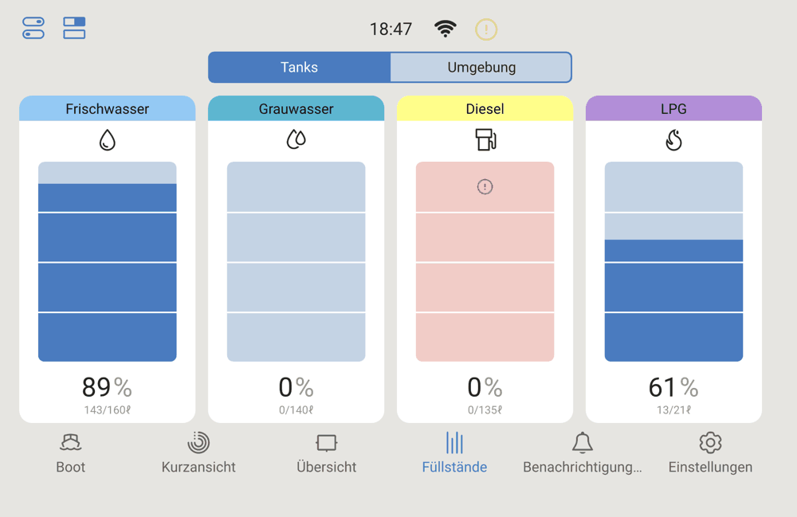
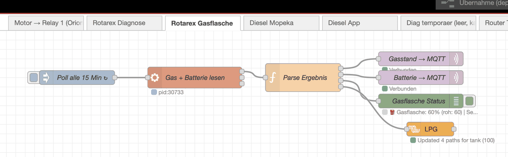
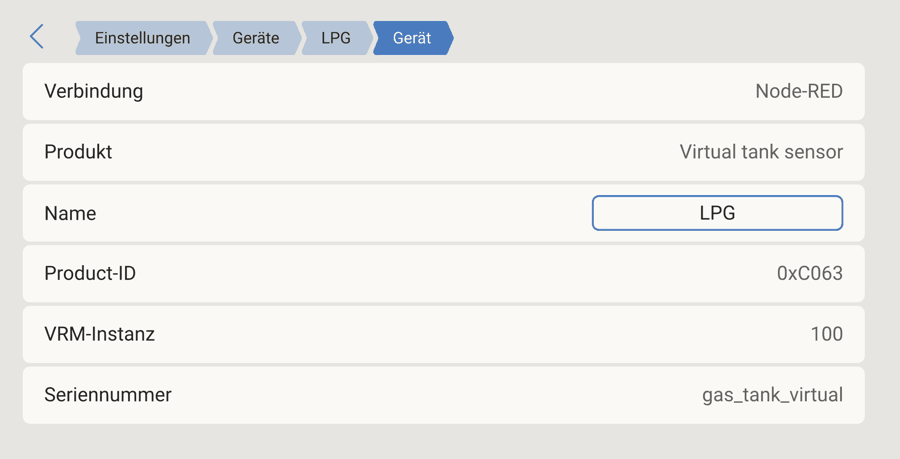
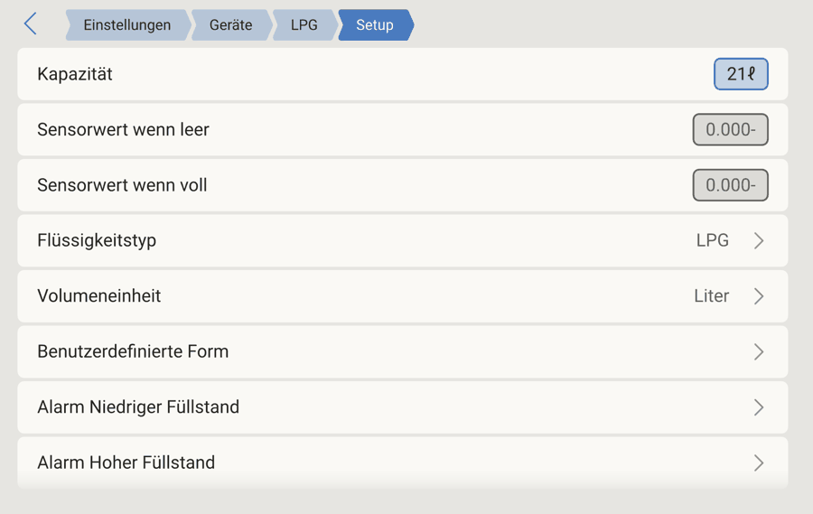
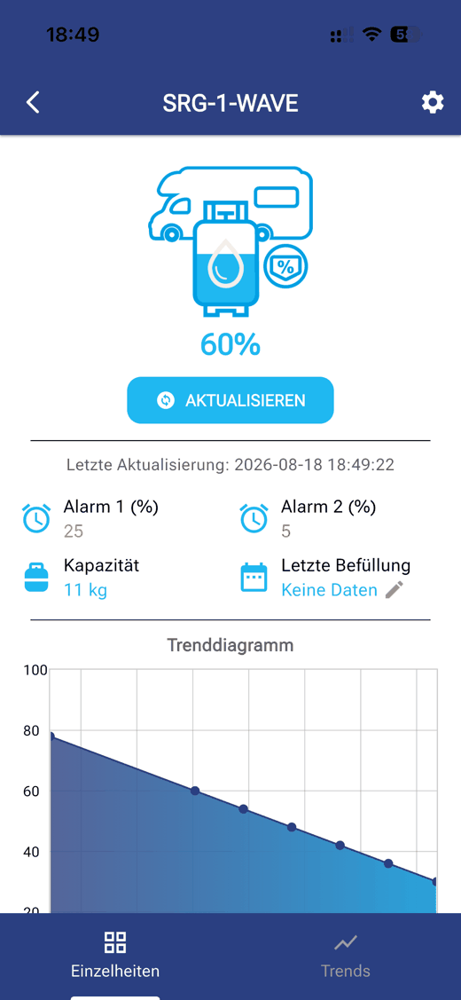

# dbus-rotarex-dime

Liest den Füllstand einer **Alugas/Rotarex-Gasflasche mit DIME/SRG-1-WAVE
Bluetooth-Modul** aus und zeigt sie als echten Tank im **Victron Cerbo GX /
VRM** an – über Node-RED, ohne bleak, ohne gatttool, direkt per BlueZ/D-Bus.



Soweit bekannt, gab es dafür bisher keine funktionierende Lösung (siehe
[Victron Community](https://community.victronenergy.com/t/rotarex-dimes-wave-bluetooth-and-cerbo-gx/19384)
und den [Pekaway-Forum-Thread](https://forum.pekaway.de/t/rotarex-dimes-srg-gas-level/1069),
der die entscheidende Vorarbeit zum GATT-Protokoll geleistet hat).

→ Ausführliche Beschreibung des Wegs dorthin:
[cologneone.de/projekte/travelmate-bluetooth](https://cologneone.de/projekte/travelmate-bluetooth)

## Was das hier löst

Die Rotarex-App verlangt beim ersten Verbinden einen PIN (steht auf dem
Typenschild der BLE-Box). Ohne diesen PIN liefert ein direkter Bluetooth-Read
auf die Füllstand-Characteristic immer `ATT error: 0x80`. Das eigentliche
Protokoll dahinter war nirgends dokumentiert – wir haben es durch einen
Bluetooth-HCI-Snoop-Mitschnitt der offiziellen App rekonstruiert:

> **Der PIN wird als reiner ASCII-Text auf Characteristic `05f5d47f`
> geschrieben. Danach ist der Read auf `2b67836b` (Füllstand) sofort
> erfolgreich.**

Entscheidend ist: `05f5d47f` gehört zu einer **anderen Service** als die
Füllstand-Characteristic. Schreibversuche auf die Write-Characteristics der
beworbenen Service führen zu nichts — das war die Sackgasse, in der die Suche
länger festhing.

Details zum vollständigen GATT-Mapping stehen in
[`scripts/read_gas_level.py`](scripts/read_gas_level.py).

## Voraussetzungen

- Victron Cerbo GX (oder anderes Venus-OS-Gerät) mit Node-RED
- [node-red-contrib-victron](https://github.com/victronenergy/node-red-contrib-victron)
  installiert (für die virtuelle Tank-Anzeige — ohne dieses Paket funktioniert
  das Auslesen trotzdem, nur ohne GX-Anzeige)
- `dbus_fast` (Python) muss auf dem Gerät verfügbar sein
- Eine Alugas/Rotarex-Flasche mit DIME/SRG-1-WAVE-Modul in Bluetooth-Reichweite

## Installation

```bash
git clone https://github.com/cologneone/dbus-rotarex-dime.git
cd dbus-rotarex-dime
bash install.sh
```

Das Script kopiert `scripts/read_gas_level.py` nach
`/data/home/nodered/.node-red/dbus-rotarex-dime/scripts/`. Alles unterhalb von
`/data/` überlebt Venus-OS-Firmware-Updates; dieser Unterordner gehört
zusätzlich dem Benutzer `nodered` und ist damit der einzige Ort, an dem
Node-RED später auch die Historie anlegen darf. Ein anderer Zielordner geht mit
`INSTALL_DIR=/pfad/nach/wunsch bash install.sh`.

Danach:

1. **Eigene Flasche finden** (siehe unten) — MAC-Adresse und PIN notieren
2. `flows/rotarex-gasflasche.json` in Node-RED importieren (Menü → Import)
3. Im `exec`-Node den Skriptpfad prüfen und die eigenen Werte eintragen:

   ```bash
   ROTAREX_MAC=AA:BB:CC:DD:EE:FF ROTAREX_PIN=1234 \
   python3 /data/home/nodered/.node-red/dbus-rotarex-dime/scripts/read_gas_level.py
   ```

4. Deploy

So sieht der Flow danach aus — Timer, Auslese-Node, Parser, MQTT und der
virtuelle Tank:



### Konfiguration

Alles über Umgebungsvariablen, nichts wird im Code eingetragen:

| Variable | Pflicht | Bedeutung |
|---|---|---|
| `ROTAREX_MAC` | ja | MAC-Adresse der eigenen Flasche, Format `AA:BB:CC:DD:EE:FF` |
| `ROTAREX_PIN` | ja | PIN vom Typenschild der BLE-Box |
| `ROTAREX_ADAPTER` | nein | Bluetooth-Adapter, Standard `hci0` |
| `ROTAREX_HISTORY` | nein | Pfad zu einer CSV-Datei; ist er gesetzt, wird jeder **erfolgreiche** Abruf dort angehängt |

Fehlen MAC oder PIN, bricht das Script sofort mit `{"ok": false, "error":
"not_configured"}` ab, statt in einen Bluetooth-Fehler zu laufen.

### Tank im GX einrichten

Der virtuelle Tank taucht als ganz normales Gerät auf, mit Node-RED als Quelle:



Unter *Setup* noch Kapazität und Flüssigkeitstyp setzen — für eine 11-kg-Flasche
sind das 21 Liter und LPG. Den Rest rechnet die Oberfläche selbst:



### Historie mitschreiben

```bash
ROTAREX_HISTORY=/data/home/nodered/.node-red/dbus-rotarex-dime/history.csv
```

Vier Spalten, keine Kopfzeile, Zeitstempel in UTC nach ISO 8601:

```
2026-08-18T21:59:29.695961+00:00,60,60,81
```

Also `Zeitstempel,Rohwert,Prozent,Sender-Batterie`. Geschrieben wird nur bei
erfolgreichem Abruf — eine Historie, in der Fehlversuche als leere Werte
stehen, verzerrt jede spätere Verbrauchsauswertung. Scheitert das Schreiben,
steht der Grund als `history_error` im JSON-Ergebnis, und der Flow zeigt ihn in
der Statuszeile an.

**Achtung bei Venus OS:** Node-RED läuft als Benutzer `nodered` und darf
nicht direkt nach `/data/` schreiben. Beschreibbar ist
`/data/home/nodered/.node-red/`.

## Eigene Flasche finden

MAC-Adresse und PIN findest du auf dem Typenschild der BLE-Sende-Box direkt
an der Flasche (nicht am Sensor selbst). Alternativ per BLE-Scan (z. B.
[nRF Connect](https://www.nordicsemi.com/Products/Development-tools/nRF-Connect-for-mobile))
nach einem Gerät namens `SRG-1-WAVE` suchen.

Die GATT-UUIDs (`2b67836a...`, `05f5d47e...`) sollten bei allen Geräten
dieser Modell-Reihe identisch sein — nur MAC-Adresse und PIN sind
geräteindividuell.

## Kalibrierung

Der Rohwert ist ein einzelnes Byte und entspricht **direkt dem
Prozent-Füllstand** — kein Offset, keine Kurve.

Bestätigt gleich zweifach: an einem Messpunkt außerhalb der oberen Sättigung
(Rohwert 78 bei App-Anzeige 78 %) und im direkten Vergleich zur selben Zeit —
App 60 %, Cerbo zwei Minuten zuvor 61 %, was genau dem 15-Minuten-Takt
entspricht.



Am oberen Ende der Skala ist die Auflösung allerdings gering — die offizielle
App zeigt für den gesamten Bereich 94–100 % nur „voll“ an. Ob die Zuordnung
über den ganzen Bereich linear bleibt, muss sich über weitere Referenzpunkte
zeigen. Beiträge und Issues mit euren Beobachtungen sind willkommen.

## Script aktualisieren

Ohne erneutes Auschecken, direkt auf dem Gerät:

```bash
curl -fsSL -o /data/home/nodered/.node-red/dbus-rotarex-dime/scripts/read_gas_level.py \
  https://raw.githubusercontent.com/cologneone/dbus-rotarex-dime/main/scripts/read_gas_level.py
```

## Deinstallation

```bash
bash uninstall.sh
```

Entfernt den `scripts`-Ordner der Installation. Die Historie bleibt absichtlich
liegen — sie ist das Einzige hier, was sich nicht wiederherstellen lässt; mit
`MIT_HISTORIE=ja bash uninstall.sh` verschwindet auch sie. Den Node-RED-Flow
und den virtuellen Tank-Service musst du selbst löschen — das Script sagt dir,
wie.

## Bekannte Stolperfallen

- **BlueZ verliert das Geräteobjekt** zwischen Verbindungen, wenn kein
  aktiver Scan läuft → das Script scannt deshalb bei Bedarf kurz, bevor es
  das Gerät introspiziert.
- **`le-connection-abort-by-local`**: tritt auf, wenn man direkt nach
  Stop-Discovery verbindet — kurze Pause einbauen.
- **`dbus_fast` erwartet `bytearray`**, kein Python-`list`, für
  `call_write_value()`.
- Node-RED-`exec`-Node-Ausgabe kann mehrzeilig sein (Diagnosemeldungen vor
  dem JSON) — beim Parsen immer nur die letzte Zeile als JSON behandeln.
- Node-RED läuft als Benutzer `nodered` ohne Schreibrecht auf `/data/`.
- Das BLE-Modul lässt **nur eine Verbindung gleichzeitig** zu. Solange die
  Rotarex-App verbunden ist, läuft der Abruf auf dem Cerbo ins Leere — und
  umgekehrt.

## Danksagung

- Dem [Pekaway-Forum](https://forum.pekaway.de/t/rotarex-dimes-srg-gas-level/1069)
  für den ersten GATT-Dump und die Vorarbeit
- [victronenergy/node-red-contrib-victron](https://github.com/victronenergy/node-red-contrib-victron)

## Haftungsausschluss

Dieses Projekt steht in keiner Verbindung zu Rotarex, SRG Schulz + Rackow
Gastechnik GmbH oder Victron Energy. Nutzung auf eigene Gefahr. Es handelt
sich um reines Auslesen (Read) der eigenen Hardware zu
Interoperabilitätszwecken — es werden keine Firmware-Daten verändert oder
umgangen.

## Lizenz

MIT — siehe [LICENSE](LICENSE).
